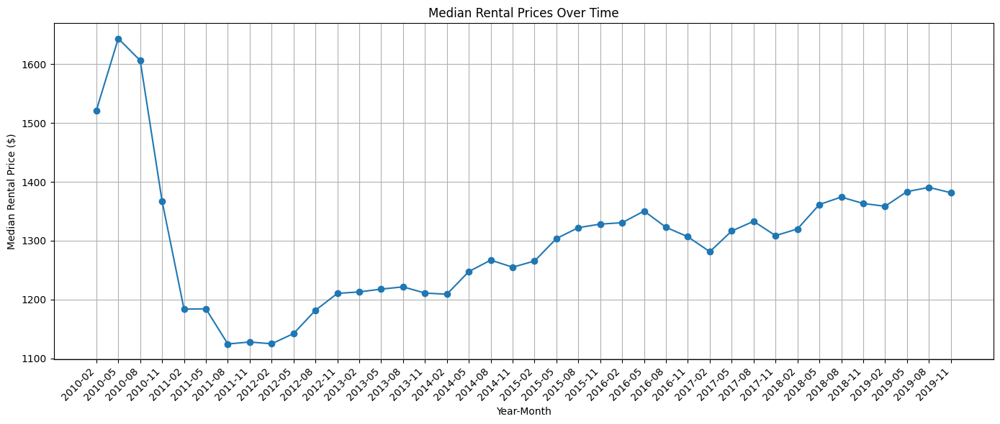
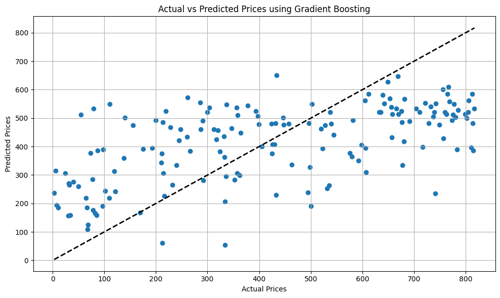

**Rental-Prediction**
The dataset used in this project contains historical rental price data for various regions. It includes features such as region name, state, metro area, county name, and monthly rental prices from 2010 to 2019.

**Models**
Several regression models are implemented in this project to predict rental prices:

- Decision Tree Regressor
- Random Forest Regressor
- Gradient Boosting Regressor
- Support Vector Regressor (SVR)
- K-Nearest Neighbors (KNN) Regressor

**Model Evaluation Scores**:

Decision Tree R2 Score: -0.3488
Random Forest R2 Score: 0.3018
Gradient Boosting R2 Score: 0.3326
SVR R2 Score: 0.0405
KNN R2 Score: 0.1855

**Evaluation**
The performance of each model is evaluated using the coefficient of determination (R^2 score) on the test data. Higher R^2 scores indicate better performance in predicting rental prices.

**Results**
The best performing model is selected based on the evaluation scores, and future rental prices are predicted using this model. A comparison between actual and predicted prices is visualized to assess the model's performance.

